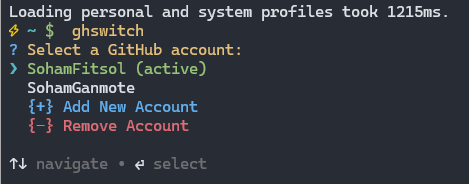

# 🚀 GitHub Account Switcher CLI (`ghswitch`)

`ghswitch` is a powerful and user-friendly CLI tool that lets you **instantly switch between multiple GitHub accounts**, update your Git identity, and manage accounts — all from your terminal.

No more:

* Logging out manually
* Re-authenticating repeatedly
* Changing Git config every time

Just one clean, fast command. 🎯

---

## 🌟 Features

* 🔄 **Switch GitHub CLI accounts instantly** (no browser required)
* 👤 **Automatically update Git `user.name` and `user.email`** based on selected account
* ➕ **Add new GitHub accounts** directly from the tool
* ➖ **Remove saved accounts** easily
* 🎨 **Beautiful colorful CLI** (powered by `chalk`)
* 🧠 **Remembers multiple accounts** using `gh auth status`
* 💻 Works on **macOS, Linux, and Windows**

---

## ⚡ Requirements

* [GitHub CLI (`gh`)](https://cli.github.com) installed
* At least **two GitHub accounts authenticated once** using:

```bash
gh auth login
```

👉 You only do this *once per account*.
After that, you **never** need to log in again — `ghswitch` simply switches between stored tokens.

---

## 📦 Installation

1. **Clone the repository:**

```bash
git clone https://github.com/SohamGanmote/ghswitch
cd gh-switcher
```

2. **Install Node.js dependencies:**

```bash
npm install
```

3. **Link the CLI globally:**

```bash
npm link
```

Now you can use `ghswitch` **from anywhere** in your terminal 🌍

---

## 🧠 Configure Git Profiles (IMPORTANT)

To allow automatic Git identity switching, update the profiles inside:

```js
const gitProfiles = {
    SohamGanmote: {
        name: "Your Git Name",
        email: "your@email.com",
    },
    SohamWork: {
        name: "Your Other Git Name",
        email: "your-other@email.com",
    },
};
```

* These emails should match the GitHub account you use
* `ghswitch` will automatically run:

```bash
git config --global user.name "<name>"
git config --global user.email "<email>"
```

When switching accounts.

💡 This ensures your commits are always associated with the correct account.

---

## 🖥 Usage

Just run:

```bash
ghswitch
```

You will see a menu like:

```
Select a GitHub account:
  SohamGanmote (active)
  SohamWork
  {+} Add New Account
  {-} Remove Account
```

### What you can do:

✔ Select any account → instantly switches
✔ Add new account → opens GitHub login flow
✔ Remove account → deletes token securely

---

## 🔄 How Switching Works

When selecting an account, `ghswitch` will:

1. Run:

   ```bash
   gh auth switch --user "<account>"
   ```

2. Apply matching Git identity:

   ```bash
   git config --global user.name "<name>"
   git config --global user.email "<email>"
   ```

3. No login required

4. No browser

5. No OTP

6. Works instantly ⚡

---

## 📸 Screenshot



---

## 📝 Notes

* You **must** run `gh auth login` once per account before using `ghswitch`.
* After that, switching is instant — no browser required.
* Ensure your Git emails match the GitHub accounts for correct commit attribution.

---

## ❤️ Contribute

Feel free to open issues or submit PRs to improve the tool!

---

🚀 Switch GitHub accounts like a pro
